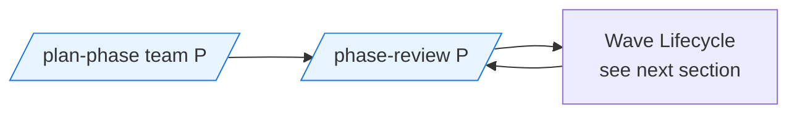
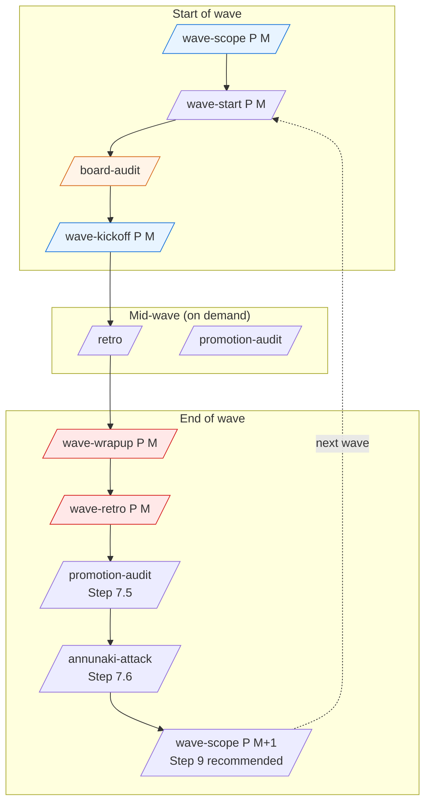
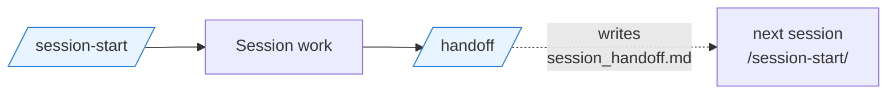

# Skill Lifecycle — Canonical Order and Preconditions

Single source of truth for the order, preconditions, and state effects of the lifecycle skills that bracket a **phase**, a **wave**, and a **session**. Closes [noorinalabs-main#426](https://github.com/noorinalabs/noorinalabs-main/issues/426).

Every cell in the tables below was derived by reading the corresponding `SKILL.md` at this PR's HEAD — not an idealized order. Where this doc and a `SKILL.md` disagree, the `SKILL.md` is authoritative until the discrepancy is filed and resolved as a follow-up.

## How to use this doc

- **New session, unsure what to run next?** Read the table for the current bracket (session / wave / phase), find the row whose "Side effects + state written" you have already, and run the row below it.
- **Onboarding a teammate?** The diagrams in each section show the canonical flow.
- **Adding a new lifecycle skill or rearranging an existing one?** Update this file in the same PR.

## Conventions used in the tables

- **Precondition** column names the `cross-repo-status.json` keys (or transcript signals) the skill checks before proceeding. `(none)` means no machine-checked precondition.
- **State written** lists the `cross-repo-status.json` keys the skill upserts. `(none)` means no state change; `(side-effect only)` means the skill mutates external state (issues, PRs, branches) without writing to `cross-repo-status.json`.
- **Counter ownership.** When a counter is written by one skill and verified by another (e.g., wrapup → retro), the writer is the authoritative source and the verifier loud-fails on mismatch. The "Owner" column in the wave table calls this out.

---

## Phase Lifecycle

| Step | Skill | Precondition | Side effects + state written | Next skill |
|------|-------|--------------|------------------------------|------------|
| P0 | `/plan-phase {team} {P}` | Project board (project 2) reflects current open-issue state across all 8 repos. Pre-phase drift audit (Step 1) STOPs if any open issue across the org is missing from project 2. | Reads project 2 as authoritative backlog. Creates per-issue GitHub Issues with phase / assignee / category labels (Step 2-3). Posts 6-perspective review comments per issue (Step 4). Presents a proposed wave structure for owner approval (Steps 5-7). The `phase-{P}.md` plan doc that `/phase-review` reads from is hand-authored — `/plan-phase` proposes the wave structure but does not directly write the plan doc. | `/phase-review {P}` |
| P1 | `/phase-review {P}` | `.claude/team/phases/phase-{P}.md` exists. STOPs and directs to `/plan-phase` if missing (the `phase-{P}.md` plan doc is the only required input — hand-author it from `/plan-phase` Step 7's owner-approved wave structure). | (none) — read-only diagnostic. Surfaces tech-debt ratio against the 10% exit gate. May edit `phase-{P}.md` with owner confirmation. | `/wave-scope {P} {M}` (recommended next; no longer a hard gate — #1022) |

**Phase close-out:** there is no explicit close-out skill. A phase ends when every tracking issue in `phase-{P}.md` is closed and the tech-debt ratio is under the 10% exit gate. A subsequent `/plan-phase` invocation marks the next phase's planning pass.

**`/phase-review` cadence:** recommended before every `/wave-scope` — the hard Step 0.5 Gate A (same-session transcript check) was removed in #1022, so it no longer STOPs the wave-scope run. Run it on demand; the deliberate-theme safety it backstopped is held by `/wave-scope` Step 0.5 Gate B (owner-set theme, still mandatory).

---

## Wave Lifecycle

### Start-of-wave

| Step | Skill | Precondition | Side effects + state written | Owner of writes | Next skill |
|------|-------|--------------|------------------------------|-----------------|------------|
| W1 | `/wave-scope {P} {M}` | **Gate B (mandatory):** owner-set theme written to `cross-repo-status.json wave_{M}_scope.theme` + meta-issue body has `## Theme` heading (STOP otherwise). `/phase-review {P}` this session is **recommended** but no longer a hard gate (former Gate A removed — #1022). | Meta-issue body refreshed (or authored as stub if absent). Label churn applied. Upserts: `wave_{M}_scope_reconciled_at`, `wave_{M}_repos_in_scope`, `wave_{M}_meta_issue`, `wave_{M}_scope`. Optional: `wave_{M}_scope_reconciliation_note`. | `/wave-scope` | `/wave-start {P} {M}` |
| W2 | `/wave-start {P} {M}` | (none — parks itself on clean `main`, § 2; STOPs on non-regenerable dirty state or unmerged local commits). For wave N>1, expects `deployments/phase-{P}/wave-{M-1}` to exist or fall back to main. | Parks the orchestrator checkout on fresh `main`. Prunes stale worktrees. Ensures the `p{P}-wave-{M}` label. Stamps active-wave fields onto `cross-repo-status.json` on `main` via the PUT-contents recipe (`/wave-kickoff` Step 1a). The `deployments/phase-{P}/wave-{M}` branch itself is created by `/wave-kickoff` Step 1 (gh api ref-create), not locally here (#653). | `/wave-start` | `/board-audit` |
| W3 | `/board-audit` | (none — runs against project 2 and all 8 repos). Optional Wave-field options must exist on the project for label sync. | Side-effect only: bulk-adds orphan issues to project 2, bulk-syncs the Wave single-select field from `p{P}-wave-{M}` labels. Confirmation gate before any mutation. No `cross-repo-status.json` writes. | `/board-audit` | `/wave-kickoff {P} {M}` |
| W4 | `/wave-kickoff {P} {M}` | **Step 0:** `/board-audit` should have run (charter precondition; not transcript-gated yet). **Step 0a:** `wave_{M}_scope_reconciled_at` MUST exist and (if present) post-date `wave_{M-1}_retro_completed_at` / `wave_{M-1}_completed_at`. **Step 0:** `wave_{M}_repos_in_scope` MUST exist and be non-empty. **Step 0.5:** 6-check pre-flight (wave branch in every repo, child-repo implementer rule, scope correctness, 2-reviewer slate, agent naming, spawn-brief ordering). | Creates `deployments/phase-{P}/wave-{M}` branch in every repo in `wave_{M}_repos_in_scope` (Step 1). Writes `wave_{M}_branches` (per-repo SHA + status). Labels issues, hook auto-posts per-issue kickoff comments, manual all-hands kickoff on meta-issue. Status commit (active state, `wave_{M}_kicked_off_at`) lands on `main` via `gh api PUT /contents` recipe (Step 1a). | `/wave-kickoff` for `wave_{M}_branches`; the PUT-contents status commit on main uses Wanjiku (TPM) identity per Step 1a. | Implementation work; mid-wave `/retro` and `/promotion-audit` on demand. |

### Mid-wave (on demand)

| Skill | Precondition | Side effects + state written | When to run |
|-------|--------------|------------------------------|-------------|
| `/retro` | Active wave (read from `cross-repo-status.json` `current_wave`). | (none) — inline diagnostic output only. No trust-matrix updates, no feedback_log writes. | Mid-wave checkpoint, after an incident, or when the team lead wants a quick pulse without the overhead of `/wave-retro`. |
| `/promotion-audit [{wave_name}]` | Resolves `current_wave` from `cross-repo-status.json` if not provided. | Two writes: appends to `feedback_log.md` (under current retro if today's date matches, else new section); writes `.claude/team/promotion_audit_log/{wave_name}.md`. May open AUTO-tier PRs (memory→charter, charter→skill) and file DECIDE-tier issues (skill→hook always DECIDE). | Auto-invoked from `/wave-retro` Step 7.5. Standalone run between retros if drift is suspected. |
| `/watch-deploy {stg\|prod} [sha]` | A merge has triggered (stg) or the owner has approved (prod) a deploy in `noorinalabs-deploy`. | (none persisted) — polls the dispatched deploy run to terminal, classifies failures, attempts one bounded fix-forward on **stg** (e.g. re-dispatch `stg-latest`), escalates otherwise. Never approves/triggers/auto-remediates **prod**. May `/file-bug` a real defect. | After any merge that triggers a staging deploy; auto-invoked from `/wave-wrapup` Step 11.6a per fan-in wave→main merge; for prod, only after owner approval. |
| Exploratory / E2E live-app pass | Active wave; a deployed app or service reachable (live staging). Browser-driving uses the operator's **already-authenticated** session (never enter credentials / drive SSO — instruction-source boundary). | (none persisted) — drive the live app via Chrome (or Playwright), exercise the primary user flows (search / timeline / graph / admin / auth), and **file each finding per the bug→issue→PR workflow** (`CLAUDE.md § Bug Report Workflow`). Verify each finding at source before filing. | **At least once per wave that touches a deployable UI/API surface — and especially after a data-bearing change lands.** Catches live-env defects the CI/harness loop never exercises. P4W5: a ~2-minute baseline drive found ig#1016 (data client force-logs-out on any 401 without attempting `refreshAccessToken()`) + ig#1017 (raw `API error:` leak to UI). |

### End-of-wave

| Step | Skill | Precondition | Side effects + state written | Owner of writes | Next skill |
|------|-------|--------------|------------------------------|-----------------|------------|
| W5 | `/wave-wrapup {P} {M}` | `wave_{M}_repos_in_scope` exists. Open PRs targeting `deployments/phase-{P}/wave-{M}` exist or have been resolved. | Merges approved PRs. Closes resolved issues. Cleans wave worktrees. Runs `/ontology-rebuild` (Step 12). Step 10.5 upserts the three canonical counter keys: `wave_{M}_final_pr_count`, `wave_{M}_changes_requested_cycles`, `wave_{M}_top_concentration_pct` (all top-level). Final-wave-of-phase: opens wave→main PR per repo and runs the reachability gate (Step 11.5). May run `/annunaki-attack` (Step 13) + memory-to-automation audit (Step 14) as fallback; both check the run-markers `wave_{M}_annunaki_attack_ran_at` / `wave_{M}_memory_audit_ran_at` to avoid double-execution with `/wave-retro` Step 7.6 / 7.7. | `/wave-wrapup` for all three counters (authoritative — `/wave-retro` Step 2.5 verifies, never writes). Run-markers: whichever surface (wrapup or retro) runs first writes the marker. | `/wave-retro {P} {M}` |
| W6 | `/wave-retro {P} {M}` | The three counter keys exist at top level (Step 2.5 verifies against PR-level recomputation; drift > ±2 or > ±5% blocks the retro until reconciled). Runs `/ontology-librarian` (Step 1) and `/board-audit` (Step 1.5) before assessments. | Updates `.claude/team/trust_matrix.md` directly on the retro branch (NOT a side branch). Appends to `.claude/team/feedback_log.md`. Step 7.5 invokes `/promotion-audit`. Step 7.6 invokes `/annunaki-attack` if run-marker absent. Step 7.7 runs memory-to-automation audit if run-marker absent. Step 9 **recommends** (no longer auto-invokes — #1022) running `/wave-scope {P} {M+1}` and auto-drafts the next-wave meta-issue stub if absent; surfaces as kickoff blocker if not. May write `wave_{M}_counter_corrections`, `wave_{M}_annunaki_attack_ran_at`, `wave_{M}_memory_audit_ran_at`. | `/wave-retro` for corrections + run-markers. Counter writes remain owned by `/wave-wrapup`. | `/wave-scope {P} {M+1}` (recommended manual next step from Step 9 → next wave) |

### Drift surfaces this doc closes (per #426)

- **`/board-audit` is a `/wave-kickoff` precondition, not an inferred one.** W10 kickoff skipped Step 0 board-audit on the assumption that `/wave-scope` had just synced the board; 62 wave-labeled issues had their Wave-field unset on project 2 as a result. The Wave table above makes `/board-audit` an explicit W3 step.
- **Counter-write ownership lives in `/wave-wrapup` Step 10.5, not `/wave-retro`.** W9 wrapup had counter-write gaps that retro Step 2.5 had to recompute — the Owner column above codifies wrapup as the authoritative writer and retro as the verifier. Counters that drift > ±5% block the retro (per `/wave-retro` Step 2.5).
- **`/wave-retro` Step 9 recommends `/wave-scope {P} {M+1}`.** Pre-this-doc, the W9-retro → W10-scope handoff was documented only in `/wave-retro` itself. The end-of-wave table above and the Mermaid `WE3 -.->|next wave| WS2` edge make it visible from the lifecycle view. Step 9 formerly *auto-invoked* `/wave-scope`; #1022 (process-trim) made it a recommended manual next step — the auto-drafted stub meta-issue + surfaced pointer remain, only the automatic skill invocation was dropped.
- **Annunaki-attack + memory-to-automation audit moved retro-side (P3W9 #344).** Wrapup Steps 13 / 14 remain as fallback for retro-delayed cases; both surfaces guard with the `wave_{M}_annunaki_attack_ran_at` / `wave_{M}_memory_audit_ran_at` run-markers so the audit runs at most once per wave. The Owner column calls out "whichever surface runs first writes the marker."

---

## Session Lifecycle

| Step | Skill | Precondition | Side effects + state written | Next skill |
|------|-------|--------------|------------------------------|------------|
| S1 | `/session-start` | MANDATORY first action in every session (per `CLAUDE.md § Session start`). | Step 0: prunes worktrees. Step 1: team orientation — single implicit `noorinalabs` team (current harness has no `TeamCreate`/`TeamDelete` tools; spawn via the `Agent` tool with `team_name: noorinalabs`). Step 2: reads project-memory `session_handoff.md`. Step 3: runs `/ontology-rebuild` for any dirty files. Step 4: runs `/annunaki` (status only, not attack). Step 5: reads `cross-repo-status.json`, may invoke `/board-audit` if board↔label drift is observed. Step 6: reads `feedback_log.md` tail for unapplied retro proposals. | Whatever the user asks for. |
| S2 | `/handoff [notes]` | (none) — run before ending a session for richer context than the automatic `Stop` hook. | Writes `session_handoff.md` to project memory (auto-loaded at next session's Step 2). Updates `MEMORY.md` index (replaces any previous handoff entry). Echoes full handoff to console for cross-machine paste. | (end of session) |

### Session-start vs. automatic Stop hook

A `Stop` hook auto-writes a handoff to project memory after every response (throttled to 5 min). The next `/session-start` Step 2 reads whichever handoff is freshest. Manual `/handoff` adds conversational context (decisions, discussion) that the automatic hook cannot infer.

### Session hygiene — `/clear` at wave boundaries, `/compact` mid-task

Long multi-wave sessions degrade quality, not just cost: research finds marathon sessions (many unrelated tasks queued in one continuous session) underperform single-task-scoped sessions by **16–29 percentage points**, and Anthropic's own guidance is that *over-compacting within one session* is a more common failure than *under-clearing between* unrelated tasks (token-efficiency audit #986, Part 7). Two built-in CLI commands, two distinct jobs — they are **not** lifecycle skills, so they have no table row above; the discipline is:

- **`/compact`** (summarize-and-continue) — use *inside* one still-relevant task, at natural checkpoints. Rule of thumb: proactively compact around ~70% context capacity, before a step that will consume a lot of tokens. Critical facts belong in files (`.claude/memory/`, `cross-repo-status.json`), never only in the conversation, so a compaction can never drop them.
- **`/clear`** (full wipe) — use when switching to *unrelated* work. **A wave boundary is an unrelated-task boundary:** once `/wave-retro` closes a wave (and `session_handoff.md` is written), prefer `/clear` before taking on the next wave's execution rather than compacting the closed wave's context forward. The handoff mechanism (`/handoff` + the automatic `Stop`-hook `session_handoff.md`) exists precisely to carry state across the clear — the next `/session-start` Step 2 reloads it.
- **Scope a session to one wave / one coherent task.** Design for die-and-resume from the `session_handoff.md` checkpoint, not from a replayed transcript; run `/handoff` before the clear so conversational context (decisions, in-flight caveats) survives the boundary. This is discipline over the mechanisms already in place — no new tooling.
- **Keep volatile state out of the always-loaded cache prefix.** `CLAUDE.md` + the `@import`-ed `MEMORY.md` are prompt-cached across a long session's idle gaps (the org cadence — waiting on CI and owner approvals — fits the 1-hour TTL). Editing a line inside that prefix invalidates the cache (write ≈ 12.5× read), so volatile state lives *outside* it: the per-session summary in the gitignored `session_handoff.md` (the `MEMORY.md` handoff pointer is a **static** one-liner, #998), and wave/status detail behind the on-demand `wave_status.py digest` (#987), not the 200 KB status file itself.

---

## Cross-references

- Charter rules backing the lifecycle: `.claude/team/charter/agents.md` (orchestrator + spawn discipline), `.claude/team/charter/skills.md` (promotion + marker conventions), `.claude/team/charter/state-claims.md` (refresh-before-claim, refresh-before-acting), `.claude/team/charter/pull-requests.md` (retro PR body-vs-diff, origin > local).
- Per-skill SKILL.md files each contain a one-line link back to this doc in their preconditions section.

## Maintenance

- This doc is hand-maintained. Any new lifecycle skill MUST add a row to the relevant table and a Mermaid node in the same PR.
- Any rearrangement of skill order (e.g., a new precondition gate, a moved run-marker) MUST update the relevant table BEFORE the SKILL.md change lands.
- If a SKILL.md and this doc disagree, the SKILL.md is authoritative until the discrepancy is filed and resolved as a follow-up issue.
