# NoorinALabs — Architecture L3: per-container data/logic flow (#771)

The L3 zoom below the [L2 container-systems diagram](architecture.md#l2--container-systems-770).
Where L2 shows *every* container and the edges *between* them, L3 opens each
container and shows its **internal data/logic flow** plus exactly **what moves
in and out** of it — ports, volumes, env-derived connections, and the
upstream/downstream services it talks to.

Like L1/L2, every claim is derived from ground truth at the deploy repo's
`origin/main` and is auditable: each diagram (or grouped section) carries a
**Sources** note citing the exact `compose/docker-compose.prod.yml` lines (and,
where relevant, `caddy/Caddyfile` / `infra/prometheus/prometheus.prod.yml`) it
was built from, all read at `noorinalabs-deploy` **`origin/main` 273f220** (the
same revision L2 was verified against — 1505-line compose, 30 services).
Markdown is the source of truth; the mermaid blocks are version-controlled and
renderable, and feed the docs-render / Office pipeline (#767).

## Scope and structure — what gets a full diagram vs. a grouped pattern

Thirty containers do **not** warrant thirty near-duplicate boxes. Per the
deliverable's no-silent-caps rule, here is exactly what is drawn and why:

- **18 substantive containers get a full, individual L3 diagram** — the ones
  whose internal flow is distinct: the ingress + application tier (`caddy`,
  `api`, `frontend`, `landing`, `user-service`, `isnad-graph-embed`), the five
  data stores (`neo4j`, `postgres`, `redis`, `user-postgres`, `user-redis`),
  the observability core (`prometheus`, `alertmanager`, `grafana`, `loki`,
  `alloy`), and the messaging core (`kafka`, `kafka-ui`).
- **The 5 exporters are GROUPED** (`node-exporter`, `postgres-exporter`,
  `user-postgres-exporter`, `blackbox-exporter`, `kafka-exporter`) — they share
  one "read source stats → expose `/metrics` → Prometheus scrapes" pattern.
  One pattern diagram + a per-exporter table replaces five near-identical boxes.
- **The 4 pipeline workers are GROUPED** (`dedup`, `enrich`, `normalize`,
  `graph-load`) — near-identical worker bodies differing only in stage module
  and topic in/out. One stage-chain diagram (the substantive data flow) + one
  worker-internal pattern + a per-stage table.
- **The 3 one-shot/init containers are GROUPED** (`user-service-migrate`,
  `kafka-init`, `loki-runtime-init`) — all "run task → exit 0, a consumer gates
  on `service_completed_successfully`". One pattern diagram + a table.

That is 18 full diagrams + 4 grouped pattern diagrams covering all 30 services;
the [coverage matrix](#coverage-matrix--all-30-services) at the end maps every
service to where it is documented.

## How to read these diagrams

- A **rounded/cylinder node** `[( … )]` is a Docker **volume** or a host path
  (persistent state). A plain box is a process/component. A node **outside** the
  container's `subgraph` is a different container or an external host.
- Solid arrows are **active on an ordinary `docker compose up`**; **dotted**
  arrows are dormant paths — profile-gated services (`embed`, `pipeline`) or
  not-yet-wired admin controls — matching the L2 convention.
- Edge labels name the **port + protocol** (e.g. `bolt 7687`, `HTTP :8000`) or
  the operation (`scrape /metrics`, `MERGE`).
- Host-published ports are bound to `127.0.0.1` (operator SSH-tunnel access)
  unless noted as public; `caddy` `:80/:443` are the only public ports.

---

## A. Ingress & application tier

### A.1 caddy — reverse proxy / sole public ingress

`caddy` terminates TLS on the only two public ports and path-routes three
vhosts. The substantive L3 detail is the `/grafana/*` **`forward_auth`** bridge:
Caddy first calls `user-service:8000` to authorize the request, and only on a
2xx copies the `X-WEBAUTH-*` identity headers downstream to Grafana.

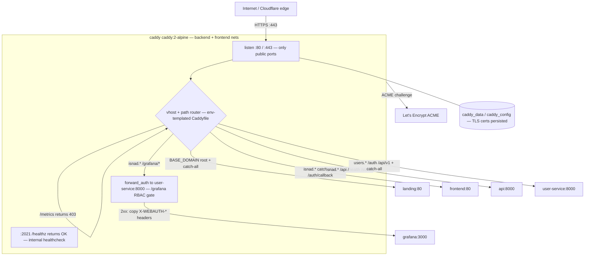

**Sources (A.1):** `compose/docker-compose.prod.yml` L379–426 (`caddy`: ports
80/443 L382–383, `BASE_DOMAIN` env L385, Caddyfile + `caddy_data`/`caddy_config`
volumes L387–389, `read_only` L390, `depends_on` api/frontend/landing/user-service
L405–413, nets backend+frontend L423–425); `caddy/Caddyfile` (`:2021 /healthz`
L9–10; `landing:80` L19; isnad vhost `/auth/callback`→frontend L57–58,
`/api/*`/`/health`/`/status`→api L64–73, `/metrics`→403 L78–79, `/grafana/*`
forward_auth→`user-service:8000` then reverse_proxy→`grafana:3000` L107–134,
catch-all→frontend L139–140; users vhost `/auth/*`→user-service L166–167, JWKS
L171–172, `/api/v1/*`→user-service, `/metrics`→403 L236, catch-all→user-service
L246–247).

### A.2 api — isnad-graph FastAPI backend

`api` runs `uvicorn … --workers 4` on a read-only rootfs (only `/tmp` tmpfs and
the `loki_runtime` volume are writable). It serves the isnad-graph REST API
against three backends and validates caller JWTs against `user-service`'s JWKS.

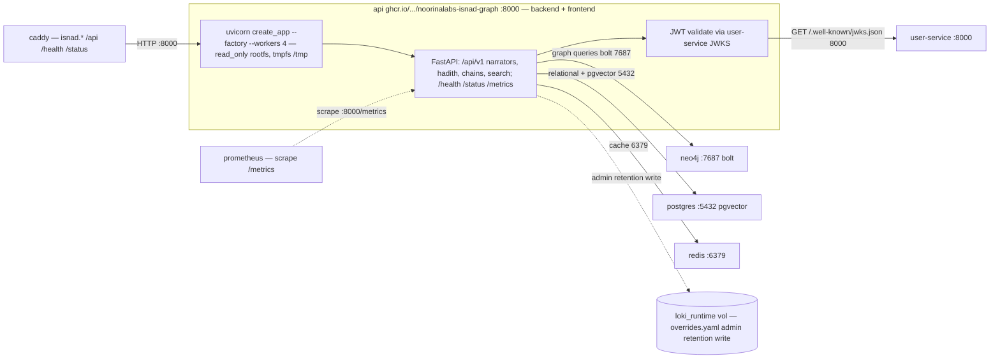

**Sources (A.2):** `compose/docker-compose.prod.yml` L115–193 (`api`: image
L123, `expose 8000` L124–125, `read_only` + tmpfs L129–132, `loki_runtime`
volume L142, `NEO4J_URI=bolt://neo4j:7687` L144, `PG_DSN` L155, `REDIS_URL`
L156, `AUTH_USER_SERVICE_URL=http://user-service:8000` L163, healthcheck
`/health` L165, `depends_on` neo4j/postgres/redis healthy L170–176, nets
backend+frontend L186–188, `uvicorn … --workers 4` command L192);
`infra/prometheus/prometheus.prod.yml` job `api` (`metrics_path: /metrics`,
target `api:8000`). The `loki_runtime` admin-write path is dormant until the
ig#1038 retention control ships (compose comment L134–141).

### A.3 frontend — isnad-graph React SPA (nginx)

`frontend` is a static nginx image whose entrypoint runs `envsubst` to inject
`USER_SERVICE_ORIGIN` into `runtime-config.js` at container start, so the SPA
calls `user-service` at an absolute origin (`users.<BASE_DOMAIN>`) rather than a
same-origin fallback.

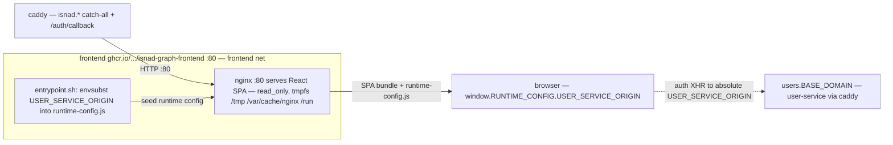

**Sources (A.3):** `compose/docker-compose.prod.yml` L292–342 (`frontend`: image
L301, `USER_SERVICE_ORIGIN=https://users.${BASE_DOMAIN}` env L314, `expose 80`
L315–316, `read_only` + tmpfs `/tmp` `/var/cache/nginx` `/run` L317–321,
`depends_on api healthy` L328–330, net frontend L340–341). The
`entrypoint.sh`/`envsubst`→`runtime-config.js` behaviour is documented in the
compose env comment L302–314 (isnad-graph#932/ig#934).

### A.4 landing — organization landing page (nginx)

The simplest container: a static Astro site served by nginx, reachable only via
`caddy` on the root domain. No backends, no state.

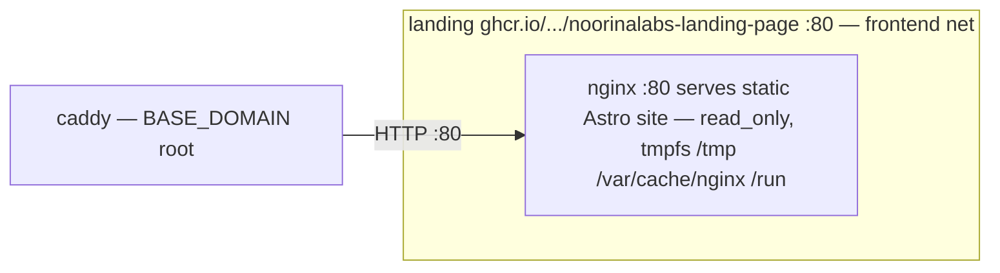

**Sources (A.4):** `compose/docker-compose.prod.yml` L344–375 (`landing`: image
L350, `expose 80` L351–352, `read_only` + tmpfs L353–357, net frontend
L373–374); `caddy/Caddyfile` L19 (`reverse_proxy landing:80` on the root vhost).

### A.5 user-service — auth / RBAC / JWT issuer

`user-service` runs `uvicorn … --workers 2` and owns OAuth login, sessions, and
RBAC. It is the only app container on **three** networks: `backend` (Caddy
inbound + api JWKS), `user-backend` (its dedicated DBs), and `egress` (outbound
OAuth token exchange). It builds its DB/Redis URLs in-process from discrete
`DATABASE_*`/`REDIS_*` component vars (URL-encoding the password), and publishes
its public key at `/.well-known/jwks.json`.

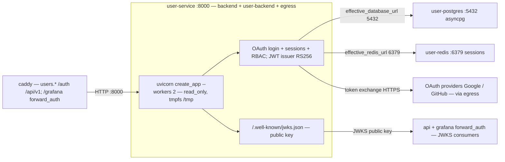

**Sources (A.5):** `compose/docker-compose.prod.yml` L494–578 (`user-service`:
image L495, `expose 8000` L496–497, `read_only` + tmpfs L498–500,
`DATABASE_HOST=user-postgres` + component vars L519–525, `REDIS_HOST=user-redis`
L526–530, `JWT_PRIVATE_KEY`/`JWT_PUBLIC_KEY` L531–532, OAuth client env
L534–539, healthcheck `/health` L540, `depends_on` user-postgres/user-redis
healthy + user-service-migrate completed L546–557, nets backend+user-backend+egress
L567–576, `uvicorn … --workers 2` L577); `caddy/Caddyfile` users vhost L166–247.

### A.6 isnad-graph-embed — one-shot corpus re-embedder (profile: embed)

Profile-gated (`embed`, `restart: "no"`) — it never runs on an ordinary deploy.
Driven by the `reembed-corpus.yml` workflow, it re-embeds the corpus with a real
384-dim multilingual sentence-transformer, rebuilds the pgvector index, and
verifies recall. The default model is **baked** into the image; `egress` is used
only for a model *swap*. Weights persist in the `st_model_cache` volume mounted
at the baked `HF_HOME`.

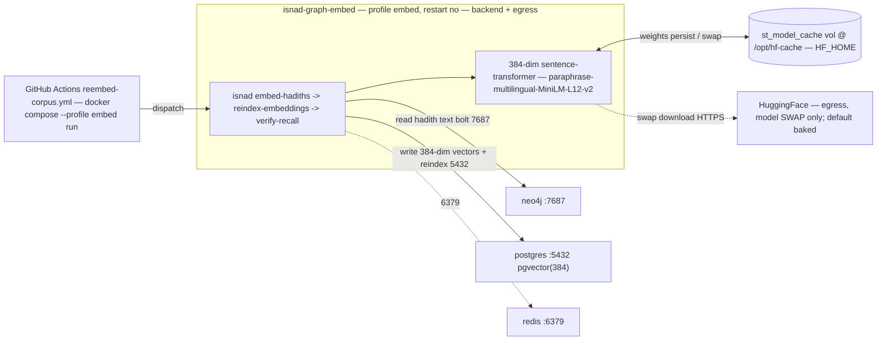

**Sources (A.6):** `compose/docker-compose.prod.yml` L230–290 (`isnad-graph-embed`:
`profiles: ["embed"]` L232, `read_only` + tmpfs L233–235, `st_model_cache:/opt/hf-cache`
volume L239, `EMBEDDING_MODEL=paraphrase-multilingual-MiniLM-L12-v2` L245,
`HF_HOME`/`SENTENCE_TRANSFORMERS_HOME`/`HOME=/opt/hf-cache` L249–251, same
`NEO4J_*`/`PG_DSN`/`REDIS_URL` as api L253–257, command sequence L262–265,
`depends_on` neo4j+postgres healthy L266–270, nets backend+egress L285–287,
`restart: "no"` L290); ADR 0008 (deploy#461) for the 384-dim re-embed rationale.

---

## B. Data stores

### B.1 neo4j — isnad graph database

The graph backend (Community 5 + APOC + Graph-Data-Science plugins). Bolt
`:7687` and HTTP browser `:7474` are both host-published on loopback only;
`api`, `graph-load-worker`, and `isnad-graph-embed` query it over bolt on the
internal `backend` network.

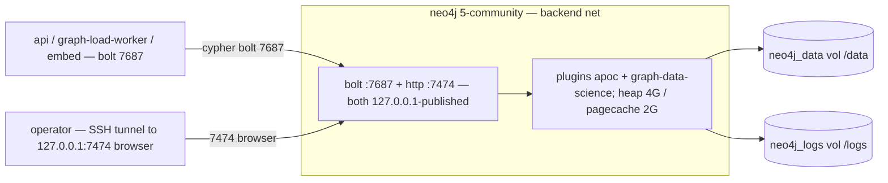

**Sources (B.1):** `compose/docker-compose.prod.yml` L22–55 (`neo4j`: image
`5-community` L26, ports `127.0.0.1:7474`/`7687` L28–29, `NEO4J_PLUGINS` apoc +
graph-data-science L32, heap/pagecache L33–34, `neo4j_data`/`neo4j_logs` volumes
L36–37, net backend L53–54).

### B.2 postgres — relational + pgvector store

`pgvector/pgvector:pg16`. Holds the isnad-graph relational data **and** the
384-dim embedding vectors (`vector(384)` with a write-time dimension guard).
Read/written by `api`, the embed runner, the pipeline-worker checkpoints, and
scraped by `postgres-exporter`.

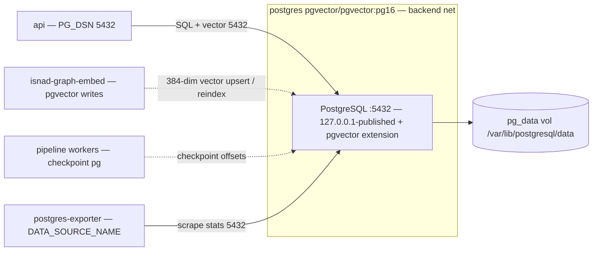

**Sources (B.2):** `compose/docker-compose.prod.yml` L57–84 (`postgres`: image
`pgvector/pgvector:pg16` L58, port `127.0.0.1:5432` L60, `POSTGRES_*` env
L62–64, `pg_data` volume L66, net backend L82–83); consumers traced from
`api.PG_DSN` L155, `isnad-graph-embed.PG_DSN` L256, worker `PG_DSN` L1311 et al,
`postgres-exporter.DATA_SOURCE_NAME` L987.

### B.3 redis — isnad-graph cache

`redis:7-alpine`, read-only rootfs with a tmpfs `/tmp`, `allkeys-lru` eviction
at 512 MB, password-protected. Used by `api` (and the dormant embed runner) as a
cache.

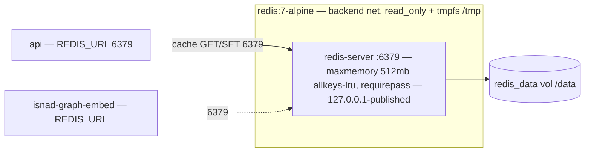

**Sources (B.3):** `compose/docker-compose.prod.yml` L86–113 (`redis`: image
L87, port `127.0.0.1:6379` L89, `redis-server --maxmemory 512mb
--maxmemory-policy allkeys-lru --requirepass` L90, `read_only` L91, `redis_data`
volume L93, tmpfs `/tmp` L95, net backend L111–112); consumer `api.REDIS_URL`
L156.

### B.4 user-postgres — user-service database

`postgres:16-alpine` (plain — no pgvector), on the isolated `user-backend`
network. Schema is applied by the one-shot `user-service-migrate` (alembic)
before `user-service` starts; scraped by `user-postgres-exporter`.

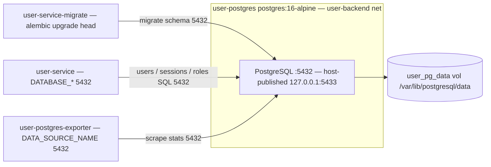

**Sources (B.4):** `compose/docker-compose.prod.yml` L580–607 (`user-postgres`:
image `postgres:16-alpine` L581, port `127.0.0.1:5433:5432` L583, `POSTGRES_*`
from `USER_POSTGRES_*` env L585–587, `user_pg_data` volume L589, net
user-backend L605–606); writers `user-service-migrate` L471–477,
`user-service.DATABASE_HOST` L519, exporter `DATA_SOURCE_NAME` L638.

### B.5 user-redis — user-service session store

`redis:7-alpine` (separate instance from `redis`), `user-backend` network,
256 MB `allkeys-lru`. Backs `user-service` sessions.

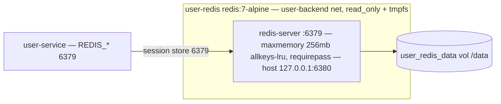

**Sources (B.5):** `compose/docker-compose.prod.yml` L609–633 (`user-redis`:
image L610, port `127.0.0.1:6380:6379` L612, `redis-server --maxmemory 256mb …
--requirepass` L613, `read_only` L614, `user_redis_data` volume L618, net
user-backend L631–632); consumer `user-service.REDIS_HOST=user-redis` L526.

---

## C. Observability

### C.1 prometheus — metrics scrape + alert source

`prometheus` v3.4.0 scrapes a fixed job set (env-selected `PROM_CONFIG_FILE`)
and pushes firing alerts to `alertmanager`. **The actual prod scrape targets**
(from `prometheus.prod.yml`) are: `api`, `user-service`, `node-exporter`,
`postgres-exporter`, `user-postgres-exporter`, `kafka-exporter` (job `kafka`),
`alloy`, and the `blackbox` `/probe` job over the public URLs — that is the
exhaustive set. (See [Corrections to L2](#corrections-to-l2): `loki` and
`grafana` are **not** scraped in prod.)

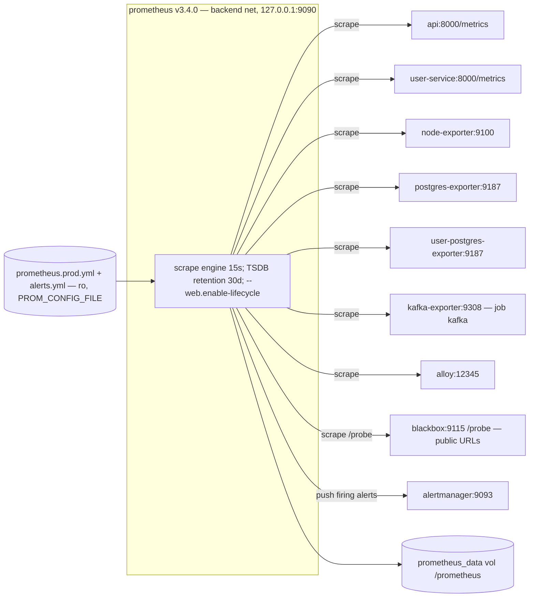

**Sources (C.1):** `compose/docker-compose.prod.yml` L662–692 (`prometheus`:
image L663, config + `alerts.yml` + `prometheus_data` volumes L669–672, command
retention/lifecycle L673–676, port `127.0.0.1:9090` L677–678, net backend
L684–685); `infra/prometheus/prometheus.prod.yml` `job_name`s: `api`,
`node-exporter`, `postgres-exporter`, `user-service`, `user-postgres-exporter`,
`kafka` (target `kafka-exporter:9308`), `alloy`, `blackbox` (`metrics_path:
/probe`, public-URL targets), plus the `alertmanager:9093` alerting target.

### C.2 alertmanager — alert routing / fan-out

`alertmanager` v0.28.1 receives alerts from `prometheus` and routes them to
receivers whose secrets are read from `*_file` mounts (each defaulting to the
literal `<unset>` placeholder, resolved at send time). `egress` gives it
outbound reach to Slack / SMTP / Healthchecks.io.

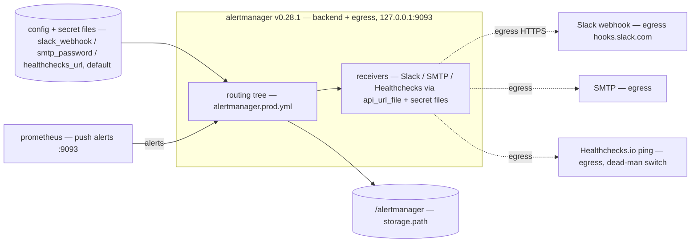

**Sources (C.2):** `compose/docker-compose.prod.yml` L694–751 (`alertmanager`:
image L695, config + Slack/SMTP/Healthchecks `*_file` secret mounts L706–722,
command `--config.file`/`--storage.path` L723–725, port `127.0.0.1:9093`
L726–727, nets backend+egress L740–741); receiver wiring + `<unset>` placeholder
behaviour in the compose comments L696–722 (deploy#262/#263/#452/#453).

### C.3 grafana — dashboards (forward_auth SSO)

`grafana` 11.6.0 is published nowhere on the host (`expose: 3000`, `backend`
only) — the only caller able to reach it is Caddy. It runs in **auth-proxy**
mode: it trusts the `X-WEBAUTH-USER` / `X-Webauth-Role` headers Caddy injects
after its `/grafana` `forward_auth` check (whitelisted to RFC1918 sources), so
there is no second login. It queries Prometheus and Loki as datasources.

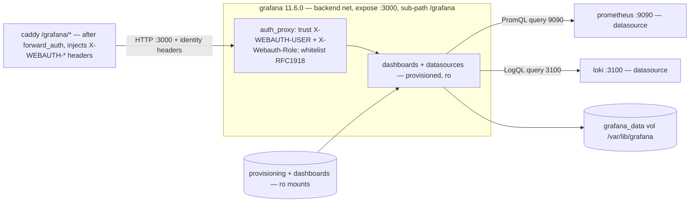

**Sources (C.3):** `compose/docker-compose.prod.yml` L753–822 (`grafana`: image
L754, `grafana_data` + provisioning + dashboards volumes L755–758,
`GF_SERVER_ROOT_URL …/grafana` + `SERVE_FROM_SUB_PATH` L770–771,
`GF_AUTH_PROXY_*` header-trust + `WHITELIST` RFC1918 L779–801, `expose 3000`
L802–803, `depends_on` prometheus+loki healthy L809–813, net backend L814–815);
`caddy/Caddyfile` `/grafana/*` forward_auth block L107–134.

### C.4 loki — log aggregation

`loki` 2.9.10 ingests log streams pushed by `alloy` and is queried by `grafana`.
Its hot-reloadable per-tenant retention override (`overrides.yaml` on the shared
`loki_runtime` volume) is seeded by the one-shot `loki-runtime-init` and, once
ig#1038 ships, rewritten in place by `api` — picked up on the next 30s
`runtime_config` reload with no Loki restart.

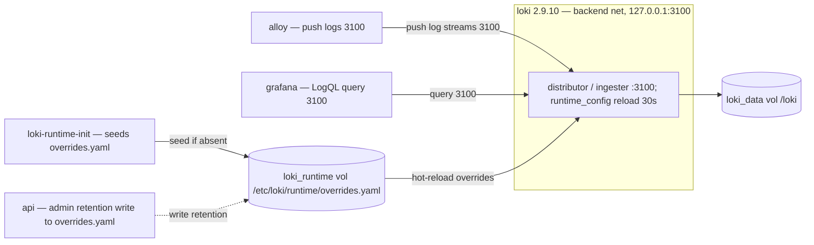

**Sources (C.4):** `compose/docker-compose.prod.yml` L855–890 (`loki`: image
`grafana/loki:2.9.10` L856, config + `loki_data` + `loki_runtime` volumes
L857–863, command `-config.file` L864–865, port `127.0.0.1:3100` L866–867,
`depends_on loki-runtime-init service_completed_successfully` L874–878, net
backend L879–880); the `overrides.yaml` seed/reload contract in the api volume
comment L134–142 and loki volume comment L860–863.

### C.5 alloy — log shipper (promtail successor)

`alloy` v1.16.1 discovers containers via the Docker socket, tails their JSON log
files, runs a relabel/JSON pipeline (a 1:1 port of the old promtail config), and
pushes to `loki`. Prometheus also scrapes its own `:12345` metrics.

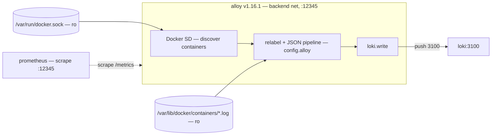

**Sources (C.5):** `compose/docker-compose.prod.yml` L892–940 (`alloy`: image
pinned-by-digest L898, `config.alloy` + `docker.sock` + `/var/lib/docker/containers`
ro mounts L899–902, command `run … --server.http.listen-addr=0.0.0.0:12345`
L903–906, `depends_on loki healthy` L926–928, net backend L929–930);
`infra/prometheus/prometheus.prod.yml` `alloy` job (target `alloy:12345`).

### C.6 Exporters (grouped) — node / postgres / user-postgres / blackbox / kafka

The five exporters share one pattern: read stats from one source and expose them
as Prometheus `/metrics` (or `/probe`) on the `backend` network, where
Prometheus scrapes them. Rather than five near-identical boxes, here is the
pattern once and a per-exporter table.

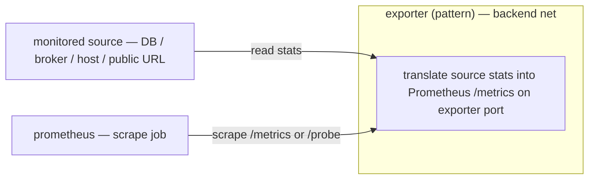

| Exporter | Image | Port | Source it reads | Networks | Host-published? |
|---|---|---|---|---|---|
| `node-exporter` | `prom/node-exporter:v1.9.1` | `:9100` | host `/proc` `/sys` `/` (ro) + textfile collector dir | backend | `127.0.0.1:9100` |
| `postgres-exporter` | `quay.io/.../postgres-exporter:v0.16.0` | `:9187` | `postgres:5432` via `DATA_SOURCE_NAME` | backend | `127.0.0.1:9187` |
| `user-postgres-exporter` | `quay.io/.../postgres-exporter:v0.16.0` | `:9187` | `user-postgres:5432` via `DATA_SOURCE_NAME` | user-backend + backend | no (`expose`) |
| `blackbox-exporter` | `prom/blackbox-exporter:v0.25.0` | `:9115` | probes **public** Caddy routes (real DNS/TLS) | backend + frontend | no (`expose`) |
| `kafka-exporter` | `danielqsj/kafka-exporter:v1.9.0` | `:9308` | `kafka:9092` broker + consumer-group stats | backend | no (`expose`) |

`blackbox-exporter` is the one that differs in flow: it is dual-homed
(`backend` for the scrape, `frontend` for outbound) so it can probe the **public**
endpoints; Prometheus scrapes its `/probe` job (60s) rather than a passive
`/metrics`. `user-postgres-exporter` is dual-homed (`user-backend` to read its
DB, `backend` so Prometheus can scrape it across the network boundary).

**Sources (C.6):** `compose/docker-compose.prod.yml` `node-exporter` L942–982
(host mounts L946–958, textfile collector L968, port `127.0.0.1:9100` L944–945),
`postgres-exporter` L984–1006 (`DATA_SOURCE_NAME` L987, port L988–989,
`depends_on postgres` L995–997), `user-postgres-exporter` L635–658
(`DATA_SOURCE_NAME` `user-postgres` L638, `expose 9187` L639–640, nets
user-backend+backend L649–651), `blackbox-exporter` L1014–1039 (config L1016–1017,
`expose 9115` L1020–1021, nets backend+frontend L1027–1029), `kafka-exporter`
L1162–1215 (`--kafka.server=kafka:9092` + `--web.listen-address=:9308` L1185–1187,
`expose 9308` L1188–1189, `depends_on kafka` L1201–1203);
`infra/prometheus/prometheus.prod.yml` jobs `node-exporter`, `postgres-exporter`,
`user-postgres-exporter`, `kafka` (target `kafka-exporter:9308`), `blackbox`
(`/probe`).

---

## D. Messaging & pipeline

### D.1 kafka — single-node broker (KRaft)

Single-broker Apache Kafka in KRaft mode (no ZooKeeper): one process is both
`controller` (quorum on `:9093`) and `broker` (`INTERNAL://:9092`, plaintext).
Not published to the host or `frontend` — reachable only on `backend` by
`kafka-init`, the pipeline workers, `kafka-ui`, and `kafka-exporter`.

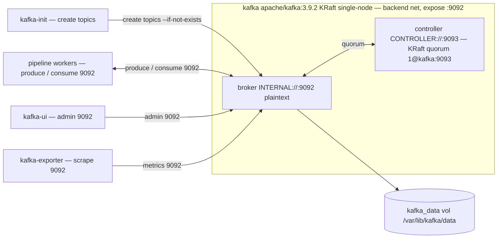

**Sources (D.1):** `compose/docker-compose.prod.yml` L1056–1134 (`kafka`: image
`apache/kafka:3.9.2` L1077, KRaft env `NODE_ID`/`PROCESS_ROLES controller,broker`/
`CONTROLLER_QUORUM_VOTERS 1@kafka:9093` L1080–1082, listeners
`INTERNAL://:9092,CONTROLLER://:9093` L1092–1095, `kafka_data` volume L1107–1108,
`expose 9092` L1109–1110, net backend L1120–1121, `stop_grace_period 30s` L1125).

### D.2 kafka-ui — Kafka admin console

`provectuslabs/kafka-ui`, loopback-only (`127.0.0.1:8085`), `LOGIN_FORM` auth,
`READONLY=true`. Operators reach it via SSH tunnel; it talks to the broker on
`backend`.

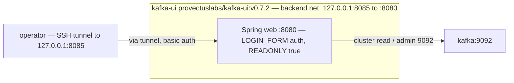

**Sources (D.2):** `compose/docker-compose.prod.yml` L1217–1251 (`kafka-ui`:
image L1220, `BOOTSTRAPSERVERS kafka:9092` L1223, `AUTH_TYPE LOGIN_FORM` +
basic-auth env L1224–1226, `READONLY` L1228, port `127.0.0.1:8085:8080`
L1229–1230, `depends_on kafka healthy` L1237–1239, net backend L1240–1241).

### D.3 Pipeline workers (grouped) — dedup / enrich / normalize / graph-load

All four are profile-gated (`pipeline`) and dormant on an ordinary deploy. They
share one body — read from a Kafka stage topic, process, checkpoint offsets to
Postgres, fetch/store payloads in B2 by pointer (over `egress`) — differing only
in stage module and topic in/out. The substantive L3 content is the **stage
chain**; the worker-internal **pattern** and a per-stage **table** follow.

Stage chain (Kafka topics between stages; terminal stage MERGEs into Neo4j):

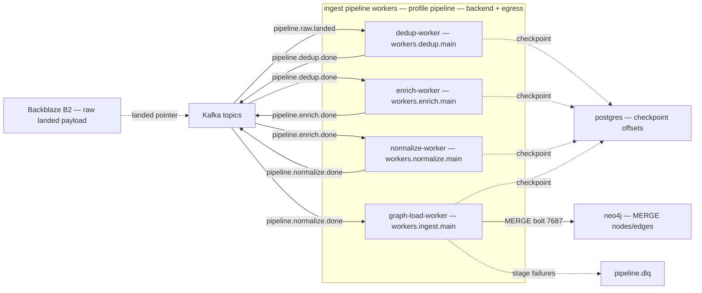

Worker-internal pattern (one stage):

```mermaid
flowchart LR
  inp["consume input topic — Kafka 9092"]
  subgraph w["worker (pattern) — read_only, tmpfs /tmp"]
    proc["process stage — dedup / enrich / normalize / graph-load"]
    ckpt["checkpoint offset — INGEST_CHECKPOINT_BACKEND=pg"]
  end
  out["produce output topic — or Neo4j MERGE if terminal"]
  b2["Backblaze B2 — S3 payload by pointer, egress"]

  inp --> proc --> out
  proc --> ckpt
  proc <-->|fetch / store payload| b2
```

| Worker | Module (`command`) | Consumes | Produces | Extra dependency |
|---|---|---|---|---|
| `dedup-worker` | `workers.dedup.main` | `pipeline.raw.landed` | `pipeline.dedup.done` | — |
| `enrich-worker` | `workers.enrich.main` | `pipeline.dedup.done` | `pipeline.enrich.done` | — |
| `normalize-worker` | `workers.normalize.main` | `pipeline.enrich.done` | `pipeline.normalize.done` | — |
| `graph-load-worker` | `workers.ingest.main` | `pipeline.normalize.done` | Neo4j MERGE (terminal) | `neo4j` (`NEO4J_*` env + `depends_on`) |

All four share `KAFKA_BOOTSTRAP_SERVERS=kafka:9092`, `INGEST_CHECKPOINT_BACKEND=pg`,
the same `PG_DSN` (as `api`), the `PIPELINE_B2_*`→`S3_ENDPOINT_URL`/`AWS_*` B2
env, and nets `backend` + `egress`. `graph-load-worker` additionally carries
`NEO4J_*` env and a `neo4j` healthy dependency because it is the terminal stage.

**Sources (D.3):** `compose/docker-compose.prod.yml` `dedup-worker` L1300–1338
(`profiles: ["pipeline"]` L1302, `command workers.dedup.main` L1304,
`KAFKA_BOOTSTRAP_SERVERS`/`INGEST_CHECKPOINT_BACKEND`/`PG_DSN`/`PIPELINE_*`/`AWS_*`
env L1308–1318, `depends_on` kafka+kafka-init+postgres L1319–1325, nets
backend+egress L1326–1328), `enrich-worker` L1340–1377 (`command` L1343),
`normalize-worker` L1379–1416 (`command` L1382), `graph-load-worker` L1422–1465
(`command workers.ingest.main` L1425, `NEO4J_*` env L1439–1441, `depends_on` adds
`neo4j` L1444–1452); stage/topic chain from the compose block comment L1262–1267.

---

## E. One-shot / init containers (grouped) — migrate / kafka-init / loki-runtime-init

Three containers run a task to completion and exit; a downstream service gates
on `service_completed_successfully` so it never starts against an
unprepared dependency. One pattern + a table.

```mermaid
flowchart LR
  dep["dependency healthy — depends_on"]
  subgraph init["one-shot init (pattern) — restart: no"]
    run["run task, then exit 0"]
  end
  cons["consumer waits service_completed_successfully"]

  dep -->|healthy| run -->|exit 0| cons
```

| Init container | Image | Task | Gates (consumer waits on it) | Network |
|---|---|---|---|---|
| `user-service-migrate` | `…/noorinalabs-user-service` | `alembic upgrade head` against `user-postgres` | `user-service` | user-backend |
| `kafka-init` | `apache/kafka:3.9.2` | create Kafka topics (`--if-not-exists`, idempotent) | pipeline workers (and operationally the broker is ready) | backend |
| `loki-runtime-init` | `busybox:1.37` | seed `overrides.yaml` into `loki_runtime` vol iff absent | `loki` | backend |

Each sets `restart: "no"`: a one-shot that fails should surface the non-zero
exit (cascading into the consumer's `depends_on`), not loop. `loki-runtime-init`
is the one with a *volume* side effect (it seeds, but does not clobber, an
admin-set retention value); the other two have an external side effect (DB
schema; Kafka topics).

**Sources (E):** `compose/docker-compose.prod.yml` `user-service-migrate`
L453–492 (`alembic upgrade head` L482, `DATABASE_*` env L470–477, `depends_on
user-postgres healthy` L483–485, net user-backend L487, `restart: "no"` L491;
`user-service` gates on it via `service_completed_successfully` L551–557),
`kafka-init` L1136–1160 (`init-topics.sh` mount L1149–1150, entrypoint L1151,
`depends_on kafka healthy` L1154–1156, `restart: "no"` L1159; workers gate on it
L1322–1323), `loki-runtime-init` L833–853 (busybox seed-if-absent command
L835–846, `loki_runtime` volume L847–849, `restart: "no"` L852; `loki` gates on
it L874–878).

---

## Coverage matrix — all 30 services

Every service in `compose/docker-compose.prod.yml` at 273f220, and where it is
documented above:

| # | Service | L3 location | Profile / type |
|---|---|---|---|
| 1 | `caddy` | A.1 (full) | always-on, public ingress |
| 2 | `api` | A.2 (full) | always-on |
| 3 | `frontend` | A.3 (full) | always-on |
| 4 | `landing` | A.4 (full) | always-on |
| 5 | `user-service` | A.5 (full) | always-on |
| 6 | `isnad-graph-embed` | A.6 (full) | profile `embed` (dormant) |
| 7 | `neo4j` | B.1 (full) | always-on data store |
| 8 | `postgres` | B.2 (full) | always-on data store |
| 9 | `redis` | B.3 (full) | always-on data store |
| 10 | `user-postgres` | B.4 (full) | always-on data store |
| 11 | `user-redis` | B.5 (full) | always-on data store |
| 12 | `prometheus` | C.1 (full) | always-on |
| 13 | `alertmanager` | C.2 (full) | always-on |
| 14 | `grafana` | C.3 (full) | always-on |
| 15 | `loki` | C.4 (full) | always-on |
| 16 | `alloy` | C.5 (full) | always-on |
| 17 | `node-exporter` | C.6 (grouped) | always-on exporter |
| 18 | `postgres-exporter` | C.6 (grouped) | always-on exporter |
| 19 | `user-postgres-exporter` | C.6 (grouped) | always-on exporter |
| 20 | `blackbox-exporter` | C.6 (grouped) | always-on exporter |
| 21 | `kafka-exporter` | C.6 (grouped) | always-on exporter |
| 22 | `kafka` | D.1 (full) | always-on |
| 23 | `kafka-ui` | D.2 (full) | always-on (loopback) |
| 24 | `dedup-worker` | D.3 (grouped) | profile `pipeline` (dormant) |
| 25 | `enrich-worker` | D.3 (grouped) | profile `pipeline` (dormant) |
| 26 | `normalize-worker` | D.3 (grouped) | profile `pipeline` (dormant) |
| 27 | `graph-load-worker` | D.3 (grouped) | profile `pipeline` (dormant) |
| 28 | `user-service-migrate` | E (grouped) | one-shot init |
| 29 | `kafka-init` | E (grouped) | one-shot init |
| 30 | `loki-runtime-init` | E (grouped) | one-shot init |

## Corrections to L2

While reading ground truth for L3, one L2 caveat turned out to be wrong, and is
**fixed in the same PR as this doc** (so `main` lands self-consistent):

- **Prometheus scrape set.** L2 drew `prometheus` scraping `loki` and `grafana`
  (and omitted `alloy`), with the scrape edges flagged *unverified pending a read
  of the Prometheus config*. Reading `infra/prometheus/prometheus.prod.yml` at
  273f220, the prod job set is exactly: `api`, `user-service`, `node-exporter`,
  `postgres-exporter`, `user-postgres-exporter`, `kafka` (target
  `kafka-exporter:9308`), `alloy`, and `blackbox` (`/probe`). **`loki` and
  `grafana` are not scraped in prod** (`alertmanager:9093` is the alert
  *receiver*, not a scrape job). Both the L2 diagram and prose in
  [`architecture.md`](architecture.md#l2--container-systems-770) have been
  corrected (loki/grafana scrape edges removed, the `alloy` scrape edge added,
  and the caveat replaced with a verified Sources note); C.1 above reflects the
  same verified set.
